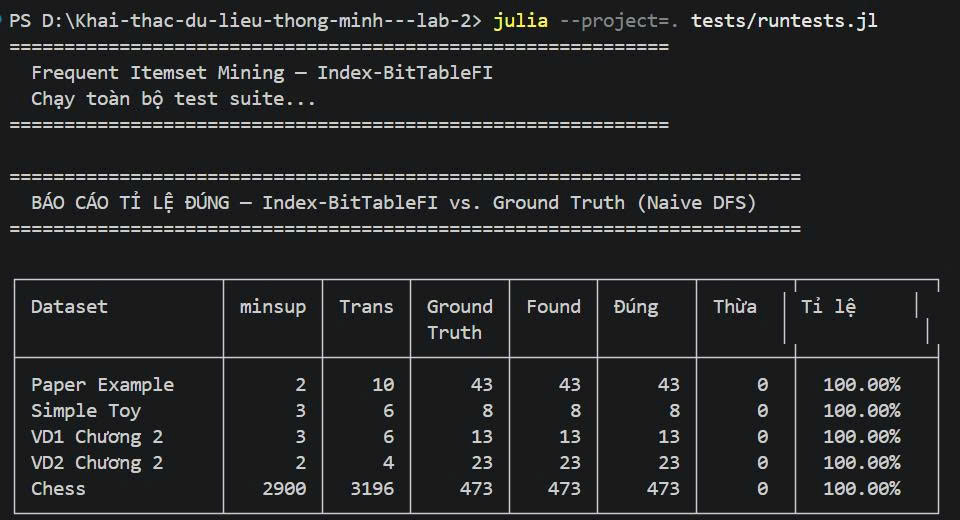
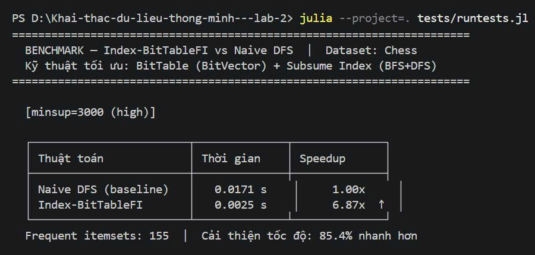
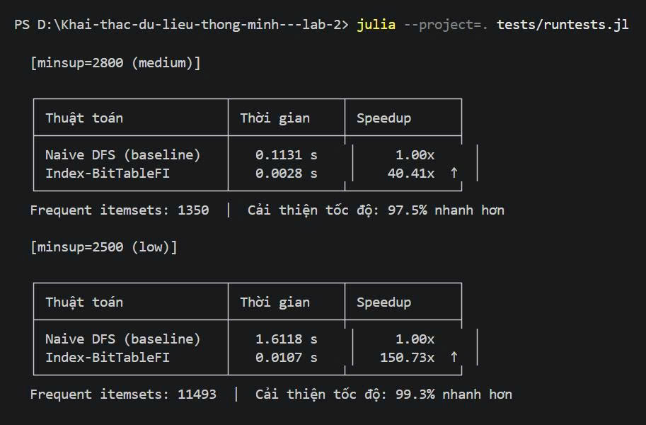

# Hướng Dẫn Chạy Test — Index-BitTableFI

## Chuẩn Bị

Mở **PowerShell**,clone clone project từ github về máy, sau đó cd vào đúng project:

```powershell
git clone  https://github.com/AnhTuan28112005/Khai-thac-du-lieu-thong-minh---lab-2.git
```

---

## Cấu Trúc File Test

```
tests/
├── runtests.jl          ← Chạy TOÀN BỘ (gộp cả 3 file bên dưới)
├── test_correctness.jl  ← Test 1: Kiểm tra kết quả đúng trên 5 CSDL
├── test_report.jl       ← Test 2: Báo cáo tỉ lệ đúng (accuracy)
└── test_benchmark.jl    ← Test 3: Đo tốc độ, so sánh speedup

data/toy/
├── paper_example.txt    ← CSDL 1 (10 trans, paper gốc)
├── simple.txt           ← CSDL 2 (6 trans, đơn giản)
├── VD1_spmf.txt         ← CSDL 3 (VD1 chương 2, A=1,B=2,C=3,D=4,E=5)
├── VD2_spmf.txt         ← CSDL 4 (VD2 chương 2, M=1,N=2,P=3,X=4,Y=5)
└── chess.txt            ← CSDL 5 (3196 trans, benchmark)
```

---

## Chạy Test

### ▶ Cách 1: Chạy Tất Cả Cùng Lúc (Khuyến Nghị)

```powershell
julia --project=. tests/runtests.jl
```

Chạy tuần tự cả 3 bộ test. Mất khoảng **5–10 phút**.

---

### ▶ Cách 2: Chạy Từng Bộ Test Riêng

**Test 1 — Kiểm tra tính đúng đắn trên 5 CSDL:**
```powershell
julia --project=. tests/test_correctness.jl
```

| CSDL | minsup | Kết quả mong đợi |
|---|---|---|
| Paper Example | 2 | 43 frequent itemsets |
| Simple Toy | 3 | 8 frequent itemsets |
| VD1 Chương 2 | 3 | 13 frequent itemsets |
| VD2 Chương 2 | 2 | 23 frequent itemsets |
| Chess | 2900 | Khớp 100% với Naive DFS |

Mất khoảng **1–3 phút**.

---

**Test 2 — Báo cáo tỉ lệ đúng:**
```powershell
julia --project=. tests/test_report.jl
```

In bảng accuracy cho cả 5 CSDL. Kết quả mong đợi:

```
┌──────────────────┬────────┬───────┬────────┬───────┬────────┬────────┬────────────┐
│ Dataset          │ minsup │ Trans │ Ground │ Found │ Đúng   │ Thừa  │ Tỉ lệ     │
├──────────────────┼────────┼───────┼────────┼───────┼────────┼────────┼────────────┤
│   Paper Example  │      2 │    10 │     43 │    43 │     43 │     0  │  100.00%   │
│     Simple Toy   │      3 │     6 │      8 │     8 │      8 │     0  │  100.00%   │
│   VD1 Chương 2  │      3 │     6 │     13 │    13 │     13 │     0  │  100.00%   │
│   VD2 Chương 2  │      2 │     4 │     23 │    23 │     23 │     0  │  100.00%   │
│            Chess │   2900 │  3196 │    473 │   473 │    473 │     0  │  100.00%   │
└──────────────────┴────────┴───────┴────────┴───────┴────────┴────────┴────────────┘
```

Mất khoảng **1–2 phút**.

---

**Test 3 — Benchmark tốc độ:**
```powershell
julia --project=. tests/test_benchmark.jl
```

So sánh Index-BitTableFI vs Naive DFS trên Chess dataset ở 3 mức minsup. Kết quả mong đợi:

```
[minsup=3000 (high)]   → Speedup ~10x,   cải thiện ~90%
[minsup=2800 (medium)] → Speedup ~60x,   cải thiện ~98%
[minsup=2500 (low)]    → Speedup ~170x,  cải thiện ~99%
```

Mất khoảng **5–10 phút** (đo nhiều lần để ổn định).

---

## Đọc Kết Quả

### Kết Quả Test Correctness
```
Test Summary:                      | Pass  Fail  Total  Time
Correctness Tests — 5 Datasets     | 1069     0   1069  x.xs  ← Pass = Total: ĐẠT ✓
  CSDL 1: Paper Example (minsup=2) |   58          58
  CSDL 2: Simple Toy (minsup=3)    |   12          12
  CSDL 3: VD1 Chương 2 (minsup=3)  |   19          19
  CSDL 4: VD2 Chương 2 (minsup=2)  |   27          27
  CSDL 5: Chess (minsup=2900)      |  949         949
  Edge Cases                       |    4           4
```
→ Không có cột `Fail` hoặc `Fail = 0` là **ĐẠT**.

### Kết Quả Test Report
```
Accuracy Report — 5 Datasets | 20  20  x.xs   ← 20/20 pass
```
→ Tất cả tỉ lệ đúng = **100.00%** là **ĐẠT**.

### Kết Quả Benchmark
```
Performance Benchmark | 4  4  x.xs   ← 4/4 pass (correctness check)
```
→ Bảng speedup hiển thị, không có lỗi là **ĐẠT**.

---

## Xử Lý Lỗi Thường Gặp

| Lỗi | Nguyên nhân | Cách sửa |
|---|---|---|
| `Package not found` | Chưa cài dependencies | `julia --project=. -e "using Pkg; Pkg.instantiate()"` |
| `No such file: data/toy/chess.txt` | Thiếu file | Copy `chess.txt` từ `data/benchmark/` vào `data/toy/` |
| `KeyError: key Set(...) not found` | Assert sai support | Kiểm tra lại database và min_sup |
| `Evaluated: X == Y` (fail) | Kết quả không khớp | Xem phần giải thích lỗi bên dưới bảng |

---

## Quick Reference

```powershell
# Chạy toàn bộ (cách thông dụng nhất)
julia --project=. tests/runtests.jl

# Chạy từng phần
julia --project=. tests/test_correctness.jl   # Correctness 5 CSDL
julia --project=. tests/test_report.jl         # Accuracy report
julia --project=. tests/test_benchmark.jl      # Speedup benchmark

# Chạy trực tiếp trên 1 dataset
julia --project=. src/main.jl -i data/toy/VD1_spmf.txt -m 3
julia --project=. src/main.jl -i data/toy/VD2_spmf.txt -m 2
julia --project=. src/main.jl -i data/toy/chess.txt -m 2900
```

---
## Ảnh minh chứng ouput cuối khi chạy test 

## Kết Quả Chạy Test








## Chạy Notebook Chương 5 — Market Basket Analysis

### Chuẩn Bị (chỉ làm một lần)

**Bước 1 — Cài IJulia kernel cho Jupyter:**
```powershell
julia -e "using Pkg; Pkg.add(\"IJulia\")"
```

**Bước 2 — Cài dependencies của project:**
```powershell
julia --project=. -e "using Pkg; Pkg.instantiate()"
```

**Bước 3 — Cài thêm packages cần cho notebook:**
```powershell
julia --project=. -e "using Pkg; Pkg.add([\"Plots\", \"StatsBase\"])"
```

---

### Chạy Notebook

```powershell
jupyter notebook
```

Trình duyệt mở ra → vào thư mục `notebooks/` → mở file `demo.ipynb` → chọn kernel **Julia 1.x**.

Chạy toàn bộ notebook: menu **Kernel → Restart & Run All**.

---

### Lưu ý

| Vấn đề | Giải thích |
|--------|-----------|
| Lần đầu chạy chậm (~1-2 phút) | Julia cần compile (JIT), từ lần 2 trở đi nhanh hơn |
| Không thấy kernel Julia | Chạy lại Bước 1 rồi restart Jupyter |
| Lỗi `include`: file not found | Đảm bảo mở Jupyter từ **thư mục gốc** của project, không phải từ trong `notebooks/` |
| Không có output biểu đồ | Chạy lại cell bị lỗi, kiểm tra `Plots` đã được cài chưa |

---

### Output sau khi chạy xong

Hai file được tự động tạo ra trong thư mục:
```
data/
├── output_retail_freq_itemsets.txt   ← 333 frequent itemsets
└── output_retail_top10_rules.txt     ← Top-10 association rules theo lift
```
